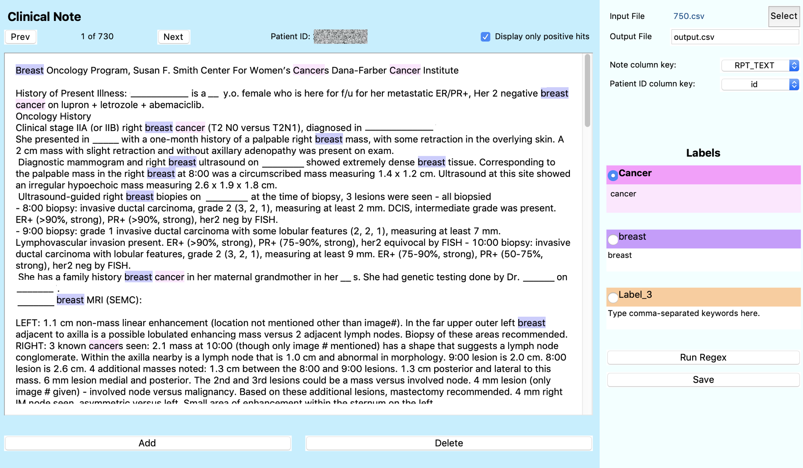

# ClinicalRegex

## Install dependencies

$ sudo easy\_install pip

$ pip3 install -r requirements.txt

## Start Program
$ python3 src/main.py

## Annotation pipeline

- Please hit 'select' file
- Please select a RPDR format or CSV format file to be searched by the program
- Type in the label names and keywords (separated by ',') to be searched and press the "Run Regex" button
- To modify the highlighted text spans, please select the label and select the note text, and then hit "Add" or "Delete"
- The program will then go through each note. Press "Save" or hit "Next" at the top of the screen 
- Repeat this through each note until the end of the file 

## Output format

| patient id  | report text | label_1_spans     | label_1_text         | label_2_spans, if applicable | .... |
| ----------- | ----------- | ----------------- | -------------------- | ---------------------------- | ---- |
| 12345678    | sample text | 1,5\|15,20\|100,300 | cancer\|CANCER\|Cancer | 200,250                      | .... |
